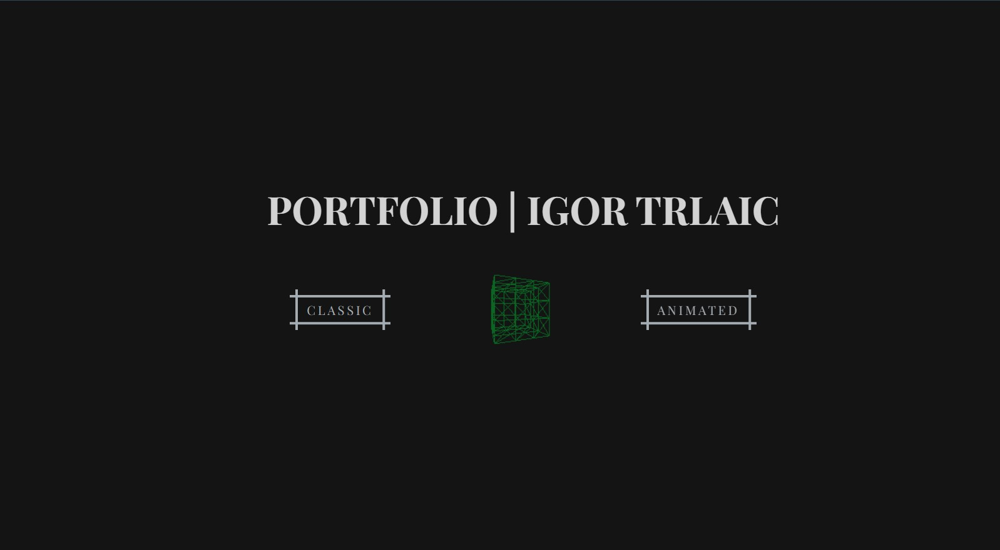

# [Personal Portfolio](https://igortrlaic.netlify.app/)
***

***  
## Technical description  
- Project is done with **Vite** as a development environment tool.
- _React + TypeScript + SCSS_ Modules was a perfect combination for my purposes here. The project is small and I believe it's not difficult to navigate around, in any case there are 2 main folders _-pages-_ and _-components-_ which are pretty much self-explanatory.  
- Portfolio is made to be responsive for all screen sizes, adapting both in size and layout design in order to be visually appealing.
- Rotating cube on the landing page is done with ThreeJS library.
- _NOTE_: Animated part of the portfolio is yet to be done, so far only the classic version is available.
***  
